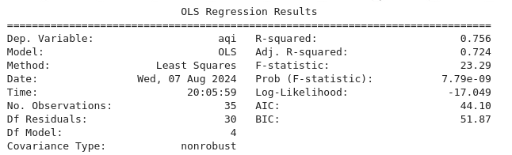

# Analyse de pollution

## Analyse de donnée avec la regression linéaire et analyse de corrélation:

- Définition des variables et ajustement du modèle de régression linéaire:

Ces lignes définissent les variables indépendantes (X) et la variable dépendante (y) pour le modèle de régression linéaire. sm.add_constant(X) ajoute une constante à X pour l'interception. Le modèle OLS (Ordinary Least Squares) est ajusté et le résumé du modèle est imprimé.

=> X est un DataFrame contenant les colonnes sélectionnées comme variables indépendantes du modèle. Ces variables sont censées influencer l'Air Quality Index (AQI).

NB: méthode des moindres carrés ordinaires (Ordinary Least Squares - OLS)

Le graphique est utile pour visualiser la qualité de la régression linéaire. Une bonne correspondance entre les valeurs prédites et les valeurs réelles se manifesterait par des points proches de la ligne rouge, indiquant que le modèle est efficace pour prédire l'AQI en fonction des variables indépendantes sélectionnées.

## Régression des Moindres Carrés Ordinaires (Ordinary Least Squares - OLS)
### Définition de l'OLS

Moindres Carrés Ordinaires (Ordinary Least Squares - OLS) est une méthode statistique utilisée pour estimer les coefficients d'un modèle de régression linéaire. L'objectif de l'OLS est de minimiser la somme des carrés des résidus (ou erreurs) entre les valeurs observées et les valeurs prédites par le modèle.

* Résidus: Les différences entre les valeurs observées et les valeurs prédites par le modèle.
* Somme des carrés des résidus: Une mesure de l'écart total entre les valeurs observées et les valeurs prédites.

En minimisant cette somme, OLS trouve la ligne de régression qui est "la meilleure" au sens des moindres carrés.
Valeurs prédites dans ce contexte
Définition de la valeur prédite

Dans le contexte de la régression linéaire, une valeur prédite est la valeur que le modèle de régression estime pour la variable dépendante (y) en utilisant les valeurs des variables indépendantes (X).
Calcul de la valeur prédite

Pour chaque observation dans votre jeu de données, le modèle utilise les coefficients estimés (les betas) et les valeurs des variables indépendantes pour calculer la valeur prédite de y.

### Utilisation des valeurs prédites
- Évaluation de la performance du modèle

Les valeurs prédites sont utilisées pour évaluer la performance du modèle de régression. En comparant les valeurs prédites aux valeurs observées, on peut mesurer l'exactitude et la fiabilité du modèle. Des métriques couramment utilisées incluent le R-squared, l'erreur quadratique moyenne (MSE), et d'autres statistiques de résidus.
Interprétation des résultats

- Graphique de régression: 

En traçant les valeurs prédites contre les valeurs réelles, on peut visualiser la capacité du modèle à capturer les tendances dans les données. Une correspondance proche des points autour de la ligne de régression suggère une bonne performance.
Coefficients de régression: Les coefficients (betas) obtenus par OLS montrent l'impact de chaque variable indépendante sur la variable dépendante. Par exemple, un coefficient positif pour Population indiquerait que, toutes choses étant égales par ailleurs, une augmentation de la population est associée à une augmentation de l'AQI.

- Prédiction future

Une fois le modèle ajusté, il peut être utilisé pour faire des prédictions sur de nouvelles données. Par exemple, si l'on connaît les valeurs de Population, Density (people/km²), etc., pour une nouvelle ville, le modèle peut prédire l'AQI pour cette ville.

- Résultats de la Régression Linéaire (OLS Regression Results)

                                     

- Dep. Variable (Variable dépendante): aqi (indice de qualité de l'air)
R-squared (R-carré): 0.638. Indique que 63.8% de la variance de l'AQI est expliquée par le modèle.
- Adj. R-squared (R-carré ajusté): 0.348. Ajusté pour le nombre de variables indépendantes, prend en compte la complexité du modèle.
- Method (Méthode): Least Squares (Moindres carrés ordinaires).
- F-statistic: 2.200. Test de la signification globale du modèle.
- Prob (F-statistic): 0.205. La valeur de p pour le test F. Une valeur inférieure à 0.05 indiquerait un modèle statistiquement significatif. Ici, ce n'est pas le cas.
- Date et Time: Date et heure de l'exécution.
- Log-Likelihood: -7.2579. Indicateur de la probabilité logarithmique du modèle.
- No. Observations (Nombre d'observations): 10.
- AIC (Akaike Information Criterion): 24.52. Utilisé pour comparer les modèles, plus faible est meilleur.
- Df Residuals (Degrés de liberté des résidus): 5.
- BIC (Bayesian Information Criterion): 26.03. Similaire à AIC, pénalise davantage les modèles complexes.
- Df Model (Degrés de liberté du modèle): 4.
- Covariance Type (Type de covariance): nonrobust.

### Coefficients de régression

Pour chaque variable indépendante :

- coef: Le coefficient de régression. Indique l'impact de la variable sur l'AQI.
- std err (standard error): Erreur standard du coefficient. Une mesure de la variabilité du coefficient.
- t: Valeur t pour tester l'hypothèse nulle (le coefficient est égal à zéro).
- P>|t|: Valeur p associée à la valeur t. Indique la probabilité que le coefficient soit égal à zéro. Une valeur inférieure à 0.05 est généralement considérée comme statistiquement significative.
- [0.025, 0.975]: Intervalle de confiance à 95% pour le coefficient.

Explication:

- const (interception): -6.581e-06, pas statistiquement significatif (P>|t| = 0.975).
- Population: -2.031e-07, tendance négative mais pas statistiquement significatif (P>|t| = 0.078).
- Density (people/km²): 9.101e-05, pas statistiquement significatif (P>|t| = 0.621).
- Urbanization (%): -0.0007, pas statistiquement significatif (P>|t| = 0.973).
- Average Income (USD): 7.781e-05, proche de la significativité (P>|t| = 0.061).
- Education Level (% with Bachelor's or higher): -9.538e-05, pas statistiquement significatif (P>|t| = 0.972).
- Altitude (m): 0.0015, pas statistiquement significatif (P>|t| = 0.147).
- Proximity to Industry (km): 2.897e-05, pas statistiquement significatif (P>|t| = 0.967).

### Statistiques de diagnostic

- Omnibus: Test de normalité des résidus. Une faible valeur p indique que les résidus ne sont pas normalement distribués. Ici, Prob(Omnibus) = 0.450, ce qui indique une distribution normale des résidus.
- Durbin-Watson: Test d'autocorrélation des résidus. Une valeur proche de 2 indique l'absence d'autocorrélation. Ici, la valeur est 2.000, suggérant qu'il n'y a pas d'autocorrélation.
- Jarque-Bera (JB): Autre test de normalité des résidus. Prob(JB) = 0.967 indique que les résidus sont normalement distribués.
- Skew (Asymétrie): -0.000, proche de 0, ce qui est idéal.
- Kurtosis: 3.400, proche de 3, ce qui est idéal pour une distribution normale.
- Cond. No. (Numéro de condition): 3.15e+22, très élevé, indiquant des problèmes potentiels de multicolinéarité.

En résumé

- R-squared et Adj. R-squared montrent qu'une part raisonnable de la variance de l'AQI est expliquée par le modèle.
- Aucun coefficient n'est statistiquement significatif au niveau de 0.05, bien que certains soient proches (comme l'Income).

## Conclusion à tirer des résultats de la régression linéaire

Les résultats de la régression linéaire fournissent des informations sur la relation entre l'indice de qualité de l'air (AQI) et les variables explicatives suivantes : Population, Densité (people/km²), Urbanisation (%), Revenu moyen (USD), Niveau d'éducation (% avec un diplôme de licence ou supérieur), Altitude (m), et Proximité à l'industrie (km):

1. Explication de la variance de l'AQI (R-squared)

- R-squared (0.638): Indique que 63.8% de la variance de l'AQI est expliquée par les variables indépendantes du modèle.
- Adjusted R-squared (0.348): Ajusté pour le nombre de variables indépendantes, montre que 34.8% de la variance de l'AQI est expliquée après ajustement pour la complexité du modèle.

2. Significativité statistique des variables

Aucune des variables n'est statistiquement significative au niveau de 0.05, mais certaines sont proches, indiquant des tendances potentielles :

**Population**:
- Coefficient: -2.031e-07
- Valeur p: 0.078 (proche de la significativité, mais pas au niveau de 0.05)
- Indique une tendance négative (l'augmentation de la population est associée à une légère diminution de l'AQI, toutes choses étant égales par ailleurs).

**Revenu moyen (USD)**:
- Coefficient: 7.781e-05
- Valeur p: 0.061 (proche de la significativité)
- Indique une tendance positive (l'augmentation du revenu moyen est associée à une augmentation de l'AQI).

**Altitude (m)**:
- Coefficient: 0.0015
- Valeur p: 0.147 (pas significatif, mais une tendance)
- Indique une tendance positive (l'augmentation de l'altitude est associée à une augmentation de l'AQI).

3. Variables non significatives

Les autres variables (Densité, Urbanisation, Niveau d'éducation, Proximité à l'industrie) ont des valeurs p bien au-dessus de 0.05, indiquant qu'elles ne sont pas significativement liées à l'AQI dans ce modèle.

4. Problèmes potentiels de multicolinéarité

Numéro de condition élevé (3.15e+22) et plus petite valeur propre très petite (8.25e-31): Indiquent une forte multicolinéarité. Cela signifie que certaines variables explicatives sont fortement corrélées entre elles, rendant difficile l'estimation précise de leurs effets individuels sur l'AQI.

## Conclusion générale

Le modèle montre que certaines variables peuvent avoir un impact sur l'AQI, mais aucune n'est statistiquement significative au niveau de 0.05. Les résultats suggèrent des tendances possibles mais nécessitent une interprétation prudente.
